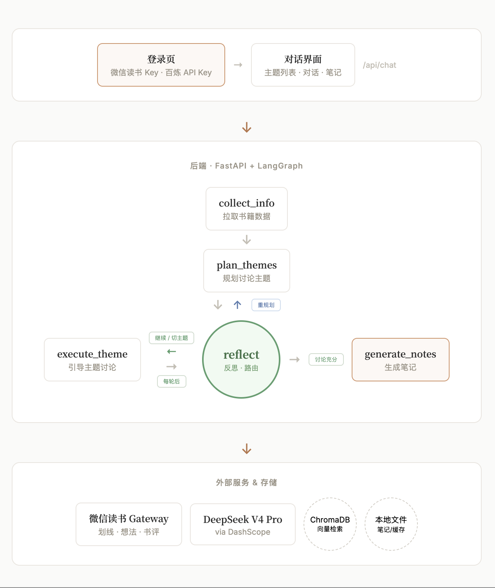

# PostReading Agent


<div align="center">

[](https://langchain-ai.github.io/langgraph/)
[](https://fastapi.tiangolo.com/)
[](https://www.deepseek.com/)
[](https://arxiv.org/abs/2303.17651)

</div>

读完一本书，和 AI 来一场有深度的对话。

PostReading Agent 是一个基于 LangGraph 的阅读讨论智能体，采用 **Plan-and-Execute + Reflection** 双范式架构。连接你的微信读书数据，通过引导式多轮对话帮你深度消化书籍内容，并自动生成结构化读书笔记。

| 登录页                                     | 对话界面                                    |
| ------------------------------------------ | ------------------------------------------- |
|  |  |

## 核心特性

- **微信读书数据接入** — 通过 Weread Skill 拉取划线、想法、热门标注和公开书评，构建个人阅读知识库
- **主题式引导讨论** — LLM 动态规划讨论主题，循序引导深度思考，而非简单问答
- **反思与自适应** — Agent 评估用户兴趣和讨论深度，自动决定继续深入、切换主题或生成笔记
- **上下文压缩** — 主题内滑动窗口 + 摘要压缩，长对话不丢失脉络
- **可折叠主题归档** — 已讨论主题自动摘要归档，可展开回顾
- **全自动笔记生成** — 整合所有主题讨论 + 用户划线原文，生成结构化读书笔记，支持下载

## 架构

Agent 采用 **Plan-and-Execute + Reflection** 双范式，以 reflect 节点为路由中心：

- **Plan**：plan_themes 分析书籍内容，规划讨论主题
- **Execute**：execute_theme 围绕当前主题引导用户讨论
- **Reflect**：reflect 评估讨论质量后决定继续深入、切换主题、重规划或生成笔记

```
   Frontend                          Backend                          External
┌──────────────┐              ┌──────────────────────┐        ┌─────────────────┐
│  登录页       │   fetch      │   FastAPI + LangGraph │       │ 微信读书 Gateway │
│  · Key 输入   │ ──────────→  │                       │       │  · 划线 · 想法   │
│              │              │  POST /api/chat       │ ←──── │  · 书评 · 标注    │
│  对话界面     │ ←──────────  │                       │        └─────────────────┘
│  · 主题面板   │    JSON      │  collect_info         │
│  · 对话区     │              │      ↓                │        ┌─────────────────┐
│  · 笔记归档   │              │  plan_themes (Plan)   │        │  DeepSeek V4 Pro│
└──────────────┘              │      ↓                │ ─────→ │  via DashScope  │
                              │  execute_theme (Exec) │ ←────  │                 │
                              │      ↓                │        └─────────────────┘
                              │  reflect (Reflect)    │
                              │   ↙  ↓  ↘             │        ┌─────────────────┐
                              │  回  重  生            │        │    ChromaDB     │
                              │  主  规  成            │ ←────  │ 向量检索 / RAG   │
                              │  题  划  笔            │        └─────────────────┘
                              │      ↓                │
                              │  generate_notes       │        ┌─────────────────┐
                              │      ↓                │        │    本地文件      │
                              │  notes/*.txt          │ ─────→ │  笔记 / 缓存     │
                              └───────────────────────┘        └─────────────────┘
```

<div align="center"></div>

## 目录结构

```
PostReading_Agent/
├── frontend/
│   ├── index.html          # 单文件前端（登录 + 聊天 UI）
│   └── image/
├── backend/
│   ├── app/
│   │   ├── main.py         # FastAPI 入口
│   │   ├── config.py       # 全局配置
│   │   ├── api/
│   │   │   └── routes.py   # /api/chat 路由
│   │   ├── models/
│   │   │   ├── state.py    # AgentState 定义
│   │   │   ├── nodes.py    # 5 个 Agent 节点
│   │   │   └── graph.py    # StateGraph 构建
│   │   ├── llm/
│   │   │   └── client.py   # LLM 客户端（DashScope → DeepSeek V4 Pro）
│   │   ├── storage/
│   │   │   └── vector_store.py  # ChromaDB 向量存储
│   │   ├── tools/
│   │   │   └── rag.py      # RAG 检索与文档摄入
│   │   └── utils/
│   │       ├── context.py          # 上下文压缩与主题归档
│   │       └── get_book_to_json.py # Weread Gateway 数据获取
│   ├── data/
│   │   ├── books/           # 书籍缓存 (JSON)
│   │   ├── notes/           # 生成笔记
│   │   └── chroma/          # 向量数据
│   ├── requirement.txt
│   └── .env
└── README.md
```

## 快速开始

### 1. 环境准备

Python 3.10+，克隆项目：

```bash
git clone https://github.com/sheihui/PostReading_Agent.git
cd PostReading_Agent/backend
pip install -r requirement.txt
```

### 2. 获取 API Key

- **百炼 API Key**：前往 [阿里云百炼控制台](https://bailian.console.aliyun.com/) 获取 DashScope API Key
- **微信读书 Key**：访问 [weread.qq.com/r/weread-skills](https://weread.qq.com/r/weread-skills) 扫码获取

两个 Key 在打开前端页面时填入即可，无需写入 `.env`。

### 3. 启动后端

```bash
cd backend
export PYTHONPATH=$(pwd):$PYTHONPATH
uvicorn app.main:app --reload --port 8000
```

### 4. 打开前端

直接用浏览器打开 `frontend/index.html`，或通过任意静态文件服务：

```bash
open frontend/index.html
```

在登录页填入两个 Key，点击「进入 PostReading」即可使用。

## API

后端启动后访问 `http://localhost:8000/docs` 查看 Swagger 文档。

**POST /api/chat**

```bash
curl -X POST http://localhost:8000/api/chat \
  -H "Content-Type: application/json" \
  -d '{
    "user_id": "user",
    "book_title": "思考，快与慢",
    "message": "你好",
    "api_key": "wrk-xxxxx",
    "llm_api_key": "sk-xxxxx"
  }'
```

响应：

```json
{
  "message": "嗨，欢迎来到读书会。今天我们一起聊聊《思考，快与慢》吧。",
  "new_messages": [
    "嗨，欢迎来到读书会。今天我们一起聊聊《思考，快与慢》吧。",
    "我们先聊聊「系统1和系统2」——你觉得日常决策中，哪个系统在主导？"
  ],
  "is_complete": false,
  "current_theme": { "topic": "系统1和系统2", "question": "..." },
  "topic_summaries": {},
  "note_file": null
}
```

**GET /api/notes/{book_title}** — 下载生成的读书笔记文件（Markdown）。

## 技术栈

- **Agent 框架**：LangGraph（Plan-and-Execute + Reflection）
- **后端**：FastAPI
- **前端**：原生 HTML/CSS/JS（无框架）
- **向量数据库**：ChromaDB
- **LLM**：DeepSeek V4 Pro via 阿里云百炼 (DashScope)
- **嵌入模型**：text-embedding-v4 via DashScope
- **数据源**：微信读书 Agent Gateway

## License

MIT
